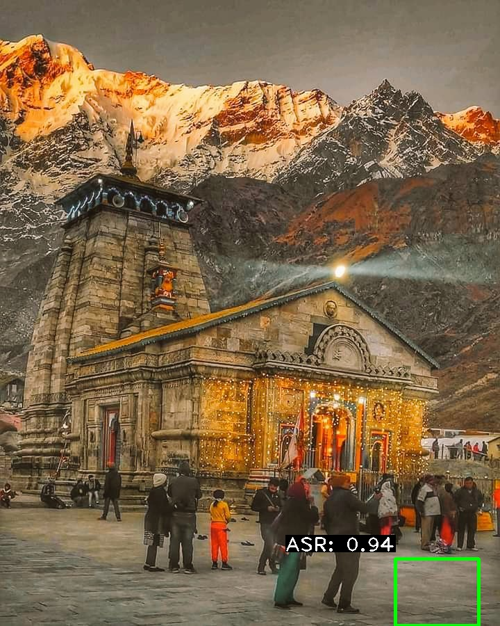
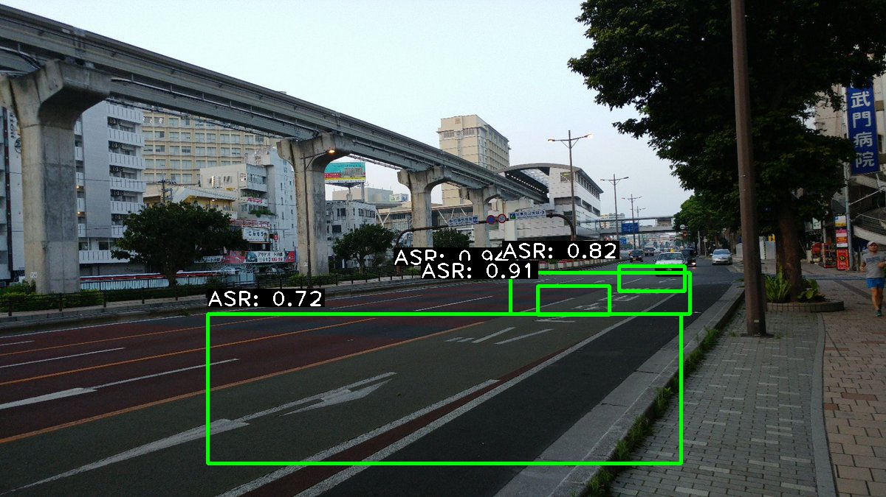
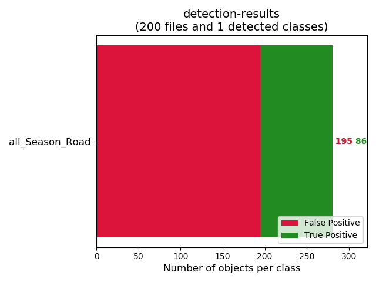
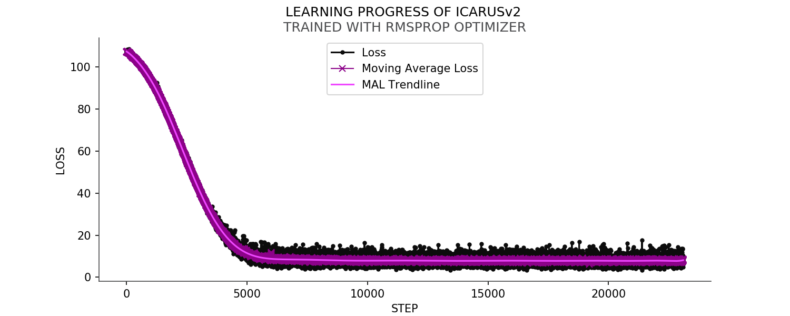
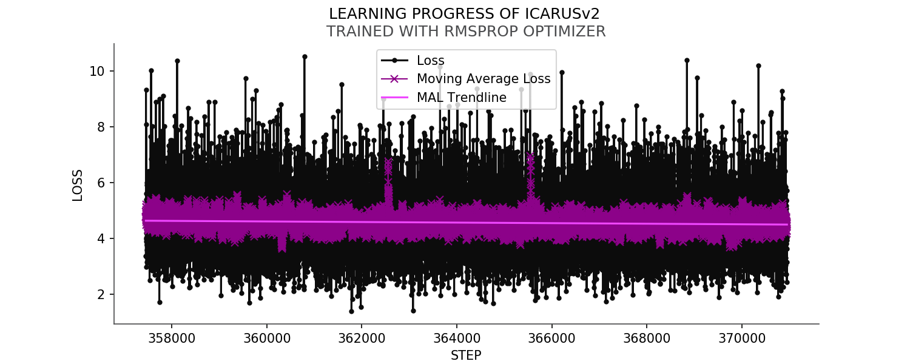
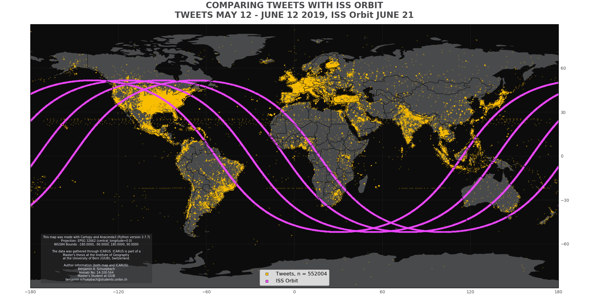
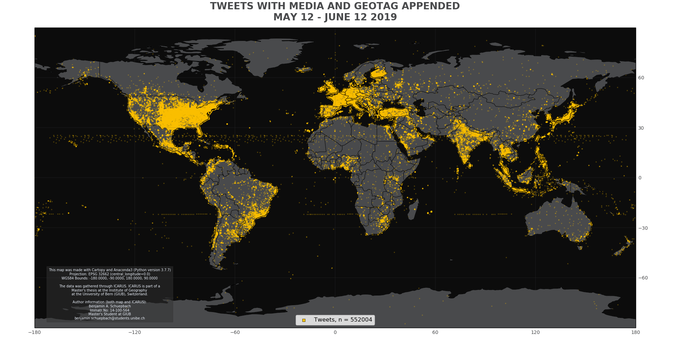
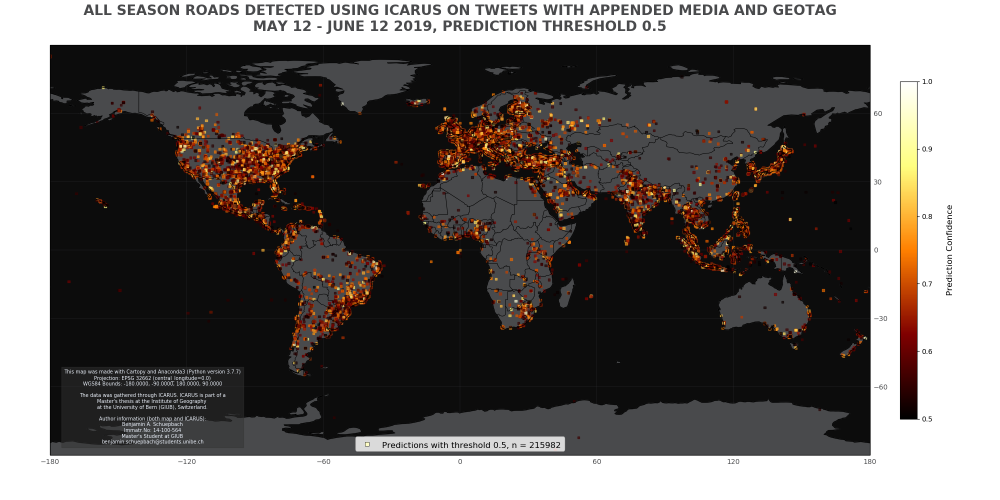
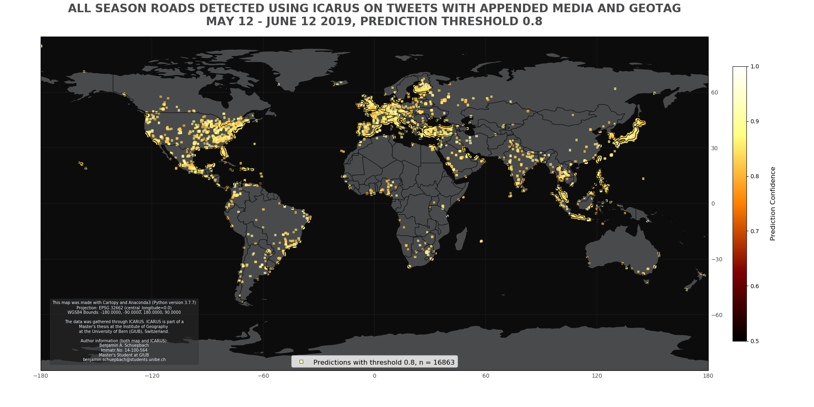
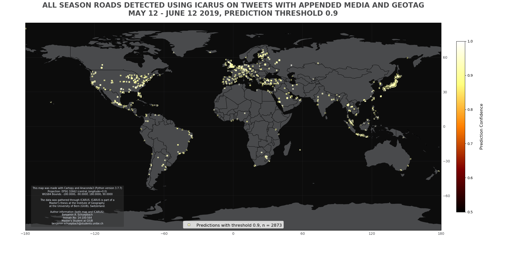

**I**mage **C**lassification **A**pplication for **R**oad **U**tility **S**tatus  

# :bird: :sunny: ICARUS  

This project is mentored by

+ [_PD Dr. Andreas Heinimann_](http://www.geography.unibe.ch/ueber_uns/personen/pd_dr_heinimann_andreas/index_ger.html)  
   from the Institute of Geography / Centre for Development   
   and Environment of the University of Bern  

Also thank you to

+ [_Prof. Dr. Paolo Favaro_](http://www.inf.unibe.ch/about_us/people/prof_dr_favaro_paolo/index_eng.html)  
   from the Computer Vision Group of the  
   Computer Science Department of the University of Bern  

for his insights into Image Classification.

ICARUS was implemented by

+ _Benjamin Schuepbach_  
   Master Student at the Institute of Geography  
   of the University of Bern  
   benjamin.schuepbach@students.unibe.ch  

----

## ABOUT ICARUS 
ICARUS, as the name so adequatly describes, is an image classification algorithm that detects all-season Roads in digital images.

EXPLAIN CONNECTION TO SUSTAINABILITY AND METAPHOR OF ICARUS HIMSELF WHO FLEW TOO CLOSE TO THE SUN

EXPLAIN GOALS:

- Show potential of big data sources for geographers working in sustainability using the example of Indicator XY of the Agenda 2030 target indicator XYZ, % of rural population with access to all season roads (ASR) within a 2km distance.

ICARUS is part of a masters thesis at the Institute of Geography of the
University of Bern (Switzerland). 

Please keep in mind: 

### ICARUS still kinda sucks...

\
Here you can see ICARUSv2 doing what it is supposed to do (kind of _at least_!):

\
Here is an example where you can see that it still has a lot to learn (it does not detect all areas with asphalt road:

\
**Obviously ICARUS is still pretty bad at detecting roads. As explained in more detail below this is in part due to time and hardware constraints resulting from my comparatively very limited budget as a university student. 
Basically my hardware could not handle more than tiny-yolo, which as a reference [scores a mean average precision (mAP) of 0.237 (or 23.7%)](https://pjreddie.com/darknet/yolo/) on the COCO dataset.**

**ICARUSv2 has a mAP of 0.051 (5.1%). This value was calculated with the incredibly useful tool from fellow github user Cartucho: [mAP](https://github.com/Cartucho/mAP)**

So, the bottom line is: ICARUSv2 still kind of sucks.  
The challenges that remain with implementing a decent version of ICARUS are as follows:

- It would be nice if one could use state-of-the-art algorithms (this for me basically means I need to upgrade my hardware)
- Along with stronger algorithms, it would be awesome to have an image segmentation feature. One reason the mAP of ICARUSv2 is so low currently, is that 
drawing rectangular bounding boxes over weirdly shaped bits of asphalt road is tricky - for humans as well as a computer. This means that even if most parts containing ASR are labeled to some degree, mAP (and aou, for that matter) scores would still be rather low.
- I had a limited time to train ICARUS as well, on bad hardware this leads to questionable results in the machine learning department of the study. Further improvements could surely be achieved if I could work on it full-time
 (My training dataset included 5000 images. I had to lable all of my training images myself, which kind of put a constraint on how many I could do).

- I started this project as a complete novice in both the field of programming as well as image classification and machine learning.

\
Enough with the excuses, though. Let's also highlight a few of the more benefitial insights this project could provide.
There are a number of interesting points that are touched on with the implementation of ICARUS.

- Big Data for Sustainability (Potentials and Shortcomings)

- Privacy & Consumer Security (also from a geographical perspective)
    - potential(s) of deep learning technologies to infringe on privacy of citizens

- Corporate Responsibility (Do global corporations with access to vast amounts of data have a responsibility in helping improve sustainability?)

## ICARUS SETUP
### Requirements & Setup
This section walks you through the setup needed to run ICARUS.
While you can run darkflow (yolo) on CPU, it is much more efficient to run it on GPU.
On a NVIDIA GPU you will need the [NVIDIA CUDA Toolkit](https://developer.nvidia.com/cuda-downloads).

#### Twitter API Access
To access the twitter API, set up an account with the [twitter developer platform](https://developer.twitter.com/) and follow their instructions.

#### Google Street View API Access
To use the Google Street View API, set up an account with the [Google developer platform](https://developers.google.com/streetview/?hl=de).

#### Training ICARUS
Here is a list of the currently top performing checkpoints from training. The best performing checkpoint is highlighted in bold.
Their success is measured as percentage of ASR detections on a validation dataset:

ICARUS v2, RMSPROP standard (with tweaks in learning rate whenever loss plateaus were hit)  
(~~crossed out~~ checkpoints were deleted due to storage space constraints)
 
Chekpoint | % of ASR Detection | Median Confidence
----------|--------------------|------------------
20000     |none                |  none
~~94500~~ |59                  |  0.61
~~96500~~ |67                  |  0.6
~~105000~~|72                  |  0.6
~~108000~~|71                  |  0.61
~~110000~~|69                  |  0.6
~~113250~~|69                  |  0.61
131250    |62                  |  0.62
133250    |69                  |  0.6
135500    |68                  |  0.59
136750    |72                  |  0.59
187500    |66                  |  0.63
256000    |66                  |  0.64
258750    |73                  |  0.61
321950    |59                  |  0.64
**344150**|71                  |  0.62
**344750**|68                 |  0.63
**357450**|80                  |  0.61
364350    |65                  |  0.63
370950    |66                  |  0.63
 
\
However, these do not actually represent a good measure of how well a chekpoint does. 
A much better representation is mAP. So I calculated mAP for all the above checkpoints.
It turned out that checkpoint 344750 had the highest mAP score. From the visualization below you can see that it still has a lot of false positives, though:

\
ICARUSv2 was trained using the tiny-yolo-voc.cfg file from [pjreddie.com](https://pjreddie.com/darknet/yolo/).
It was trained using the RMSPROP Optimizer and the following commands:  
`python flow --model cfg/tiny-yolo-ICARUSv2.cfg --train --annotation training/annotations --dataset training/fullTrainingDataset/0_allTrainingBatches --gpu 0.77 --load -1 --batch 10`

At first I trained it with a batch size of 8 and 4 subdivisions. After stagnating in training I moved to batch size of 8 and 0 subdivisions.
In the third stage I moved batch size up to 10, which saw ICARUS improve a lot. When training stagnates, it sometimes is helpful to increase batch size incrementally.
My hardware setup coulnd't handle more than batch size 10 for some reason.

Whenever a plateau of moving ave loss was hit or whenever random "nan" values would show up, I would lower the learning rate and 
continue training this way.

So at step 362550 for example, I changed to the following:  
`python flow --model cfg/tiny-yolo-ICARUSv2.cfg --train --annotation training/annotations --dataset training/fullTrainingDataset/0_allTrainingBatches --gpu 0.77 --load 362550 --trainer rmsprop --batch 10 --save 3000 --lr 0.00000005`

Then at step 365850 I changed again to:  
`python flow --model cfg/tiny-yolo-ICARUSv2.cfg --train --annotation training/annotations --dataset training/fullTrainingDataset/0_allTrainingBatches --batch 10 --gpu 0.77 --save 3000 --trainer rmsprop --load -1 --lr 0.000000008`

At step 369750:  
`python flow --model cfg/tiny-yolo-ICARUSv2.cfg --train --annotation training/annotations --dataset training/fullTrainingDataset/0_allTrainingBatches --batch 10 --gpu 0.77 --save 3000 --trainer rmsprop --load -1 --lr 0.0000000008`

A _second_ version of ICARUS**v2** was trained, using the ADAM Optimizer  
`python flow --model cfg/tiny-yolo-ICARUSv2.cfg --train --annotation training/annotations --dataset training/fullTrainingDataset/0_allTrainingBatches --batch 10 --gpu 0.77 --save 3000 --trainer adam --load -1`

**To log the values for training , I changed flow.py in** `/darkflow/net` **as follows:**  
  
        with open("training_stats.csv", 'a') as logger:
            logger.write("{}, {}, {}{}".format(step_now, loss, loss_mva, "\n"))
            logger.close()
            
This now writes a csv file in the root directory of `/darkflow`.

\
The moving average loss during training reached about 6 to 8 at 20000 steps...

\
...and around 3 to 5 at 370000 steps.

If you want to use some version of ICARUS yourself, leave me a message here on GitHub and ask me to send you a .ckpt file. I will gladly do so.

---

## HOW TO ICARUS
ICARUS is based on tiny-yolo-voc, and was developed with darkflow:

### ICARUS

explain history (ICARUS & ICARUSv2), how to use and implement

A sensible threshold value for analysis would seem to be upwards of `"thresh" : "0.83"`, as below there are too many false positives.

The checkpoint version of ICARUS which was ultimately used was ckpt#344750.

### ICARUSaver
ICARUSaver was designed to save the output of ICARUS as images including prediction bounding boxes with labels. You can provide a custom value for thresh (the yolo threshold).
This allows you to filter out predictions that do not meet your required confidence values.

### ICARUStream
ICARUStream is a standalone version of ICARUS that integrates a steam-listener for the twitter API.
It can be used just like ICARUS.

### ICARUStreetview
ICARUStreetview was used to help validate ICARUS. It is another standalone version of ICARUS which integrates the Google Street View API.
To use IARUStreetview you need to provide a Bounding Box. You then need to provide the variables lat_step and long_step.
These variables are used to create a grid within your Bounding Box. Each cell in this grid has the size lat_step x long_step.
At each intersection in the grid, a call is sent to the Google Street View API, requesting a Street View image from the location at these specific coordinates.
This is what is finally assessed by ICARUS.

### ICARUSValidation
ICARUSValidation was used to determine the quality of checkpoint files during training of ICARUS.
I initially used it to assess a validation dataset of 200 images that all contained all-season roads. ICARUSViewer saves detailed statistics of each validation
run to a seperate ouptut file (validationStatistics.txt). Later I turned to the more significant mAP, which can be calculated from the JSON predictions that darkflow can produce.

To get predictions I called:  
`python flow --model cfg/tiny-yolo-ICARUSv2.cfg --annotation annotations/validation --imgdir bilder/validation --load 344750 --json`

### ICARUSViewer
ICARUSViewer works just like ICARUSaver. But instead of saving output files, they are directly displayed on screen. This functionality can be useful if you just want to
quickly check what ICARUS is outputting.

### ICARUSTest
ICARUSTest was used to visualize the performance of different checkpoints on the validation dataset.

### ISStracker  
I had to write a quick program using the [_where the ISS at?_ API](https://wheretheiss.at/w/developer) to track the flight path of
the International Space Station (ISS). It turns out the ISS has its own twitter account - and I believed it showed in my data.
So I deployed the ISS tracker to the Raspberry Pi and compared its flight path with the strange tweets coming from the middle of the ocean.

Turns out I was half right: these images came from the [Horizon](https://twitter.com/bitsofpluto) and [DSCOVR](https://twitter.com/dscovr_epic?lang=de) spacecrafts.
Neat to see the ISS orbit on a map though lol. I found this out through the Google Chrome feature "search Google for this image".

### PLOTTiBOi
PLOTTiBoi was written to visualize some of the results of this thesis. It has three modes:

- one to plot the total amount of tweets saved per day 
- one to plot the detections made with ICARUS
- one to plot the learning progress of ICARUS

### mappyBoi  
See [GitHub Page for mappyBoi](https://github.com/taetscher/mappyBoi) for the source code.
mappyBoi is used to visualize the input/output data of ICARUS as geographic maps.
It is important to note, that due to the projection (PlateCarrée, EPSG 32662), I decided againts putting a scale bar on the map.
The issues with projected coordinate systems and scalebars are well elaborated in a nice article by user _abuckley_ over at https://www.esri.com/arcgis-blog/products/product/mapping/back-to-the-issue-of-scale-bars/.  

----

##RESULTS

Here are the results I got from running ICARUSv2 on tweets from May 12 to June 12 2019.
First, here is a map of all the tweets that were analysed:

These are the results ICARUSv2 produced...  
\
...for a threshold of 0.5:

\
...for a threshold of 0.8:

\
...for a threshold of 0.9:

----

## ACKNOWLEDGEMENTS

True to the scientific method and in the undying words of Isaac Newton, this project would not have been possible without being able to
'stand on the shoulders of giants'. Many of the components used were already available freely.
Most notably inspiration came from...

   ...the very instructive [pythonprogramming.net](https://pythonprogramming.net/machine-learning-tutorial-python-introduction/), 
   
   ...the ingenious [Mark Jay's YOLO Series](https://github.com/markjay4k/YOLO-series),
   
   ...[Cartucho's fabulous mAP calculator](https://github.com/Cartucho/mAP),
   
   ...as well as [the official YOLO Webpage](https://pjreddie.com/darknet/yolo/).

----

## THANKS
Special thanks go to everyone who helped me along the way. In particular to my mentors who helped
me achieve my ambitious goals, most notably PD Dr. Andreas Heinimann. Furthermore I owe a very special thank you to Melanie.
